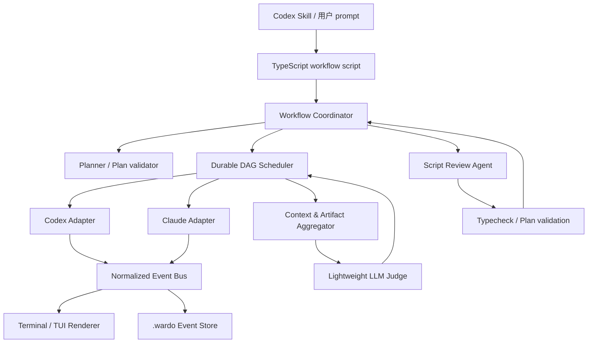

# Wardo TypeScript 重构架构方案

状态：设计草案

本文给 Wardo 设计 TypeScript 实现，运行时、skill 和 npm 包统一使用 `wardo` 命名。

## 1. 目标与边界

用户仍然只需要描述一个复杂目标，skill 就能生成一份短小的 TypeScript 脚本。脚本负责创建工作流、拆分任务、调用 Codex 或 Claude Code agent，并且可以在中断后从项目内的 `.wardo` 目录恢复。

新实现需要满足以下目标：

- 只依赖 Node.js/TypeScript，不要求 Python。
- 同时支持 `@openai/codex-sdk` 和 `@anthropic-ai/claude-agent-sdk`。
- 简单任务保持一次 agent 调用；复杂任务支持 DAG 和多层任务树。
- 默认最多并发 3 个互不依赖的子任务，并允许脚本或命令行参数提高上限。
- 每个子任务完成后使用独立的轻量 LLM 请求进行验收。验收可以要求继续推进、判定完成，或报告不可恢复失败。
- 网络、限流、503 等上游故障可按持久化的指数退避计划等待，并按配置切换模型或 provider。
- 子 agent 的中间事件可以流式显示；多 agent 同时运行时按任务分组并周期性输出汇总。
- 原始 prompt、计划、状态、attempt、事件、会话 ID、结果和验收记录都可以落盘，进程退出后可恢复。
- 在关键阶段由 Codex 或 Claude agent 审查并修改生成的脚本，校验通过后从新脚本和已有状态继续执行。

不把本版本的核心设计为通用的 LangGraph 替代品，也不把所有复杂逻辑隐藏在一条巨大 prompt 中。任务状态和依赖由本地 TypeScript 编排器负责，agent 负责具体工作。

## 2. 调研结论

### 2.1 Codex TypeScript SDK

`@openai/codex-sdk` 的 TypeScript SDK 对 Codex CLI 做了 JSONL 封装。它减少了直接解析 CLI 的工作，但运行时仍然需要 SDK 能找到对应的 Codex 可执行文件；这不是一个完全独立的 HTTP 客户端。

已确认的主要接口：

- `new Codex(options)` 创建客户端；`startThread(threadOptions)` 创建会话，`resumeThread(threadId)` 恢复会话。
- `thread.run(input, { outputSchema, signal })` 返回完整 turn；`thread.runStreamed(input, ...)` 返回异步事件生成器。
- 事件包括 `thread.started`、`turn.started`、`item.started/updated/completed`、`turn.completed`、`turn.failed` 和 `error`。
- item 可以是 agent message、reasoning、command execution、file change、MCP 调用、web search、todo 等。
- thread 选项包含工作目录、附加目录、sandbox、审批策略、模型、reasoning effort、网络和 web search；turn 可以传 `AbortSignal` 和 JSON Schema。
- `thread.id` 在首个 `thread.started` 事件后可取得。会话默认由 Codex 保存到其 sessions 目录，Wardo 另外保存映射和恢复信息。

SDK 不提供 Wardo 所需的 DAG、任务验收、长退避和跨 provider fallback，因此这些能力必须在 SDK 之上实现。一个 Thread 不应被多个并发 task 共用。

### 2.2 Claude Agent SDK

`@anthropic-ai/claude-agent-sdk` 通过 `query()` 返回可异步迭代的 `Query`，提供 Claude Code 的文件、命令和 agent 能力。

已确认的主要接口：

- `query({ prompt, options })` 返回 `AsyncGenerator<SDKMessage>`；启用 partial 消息后可以收到增量 assistant 内容。
- `system/init` 中包含 `session_id`、模型、工作目录、工具和能力信息；`result` 消息包含成功/失败、usage、模型用量、费用和结构化输出。
- `resume`、`continue`、`forkSession`、`sessionStore`、文件 checkpoint 和 `Query` 的 `interrupt()`/`close()` 支持恢复、分支和取消。
- options 支持 `cwd`、`additionalDirectories`、`model`、`fallbackModel`、`maxTurns`、`maxBudgetUsd`、thinking、JSON Schema 输出、权限回调、hooks、MCP 和内置 agents。
- 对流式输入，看到 `result` 后仍可能有 task 或 session 状态事件；适配器应消费到会话进入 idle 或 generator 结束，而不是看到第一个结果就截断。

Claude SDK 的某些能力随 Claude Code 版本变化。适配器必须记录 `system/init.capabilities`，忽略未知事件字段，并把 SDK 版本锁在 lockfile 中。

### 2.3 轻量 LLM 请求封装

默认采用 Vercel AI SDK 的 provider 组合：

```text
ai + @ai-sdk/openai + @ai-sdk/anthropic
```

它提供统一的 `generateText`、`streamText`、`generateObject`（锁定 AI SDK v6 时）和工具/结构化输出能力，适合 planner、judge、summarizer 这类短请求。`@ai-sdk/openai-compatible` 可接 OpenAI-compatible 网关；需要网关路由时再增加 `@ai-sdk/gateway`。

建议在 Node 20 LTS 上锁定 AI SDK v6 及匹配的 provider 版本。AI SDK v7 和官方 `openai` v7 的 Node 要求更高，升级时应作为一次有意的运行时迁移，而不是让依赖自动跨主版本升级。

对比：

| 方案 | OpenAI/Anthropic | 流式与结构化 | 重试与切换 | 结论 |
| --- | --- | --- | --- | --- |
| `ai` + 两个 provider | 原生支持两类 provider | `streamText`、`generateObject`、工具 | SDK 内有短重试；跨 provider 由 Wardo registry 处理 | 默认方案 |
| `openai` | 只负责 OpenAI 格式 | Responses/Chat、SSE、完整类型 | 官方短重试 | 需要 OpenAI 原生字段时作为可选底层 |
| `@anthropic-ai/sdk` | 只负责 Anthropic Messages | Messages stream、完整类型 | 官方短重试 | 需要 Anthropic 原生字段时作为可选底层 |
| LangChain provider | 两类 provider | invoke/stream/工具 | withRetry/withFallbacks | 已采用 LangGraph 时再引入，当前偏重 |
| `litellm-js` | 可以转换两类格式 | 有流式但维护信号弱 | 不足以作为可靠核心 | 不作为依赖 |

“支持 OpenAI 和 Anthropic 格式”在 Wardo 中定义为：业务层使用统一消息模型，同时可以明确指定 `openai-chat`、`openai-responses` 或 `anthropic-messages` 请求格式，并保留 provider 原生选项。不能把 AI SDK 的 UI 消息类型直接当作持久化协议。

## 3. 总体架构



各层职责：

1. **Skill 和脚本层**：把自然语言变成可读、可修改、可重复执行的 TS 文件；只暴露少量编排 API。
2. **Coordinator**：创建 run、加载/恢复 `.wardo`、调用 planner、处理 pause/resume/fork 和脚本版本。
3. **Scheduler**：维护依赖、并发、重试、租约和任务状态。它是单一状态写入者，避免多个 worker 互相覆盖 `state.json`。
4. **Agent Adapter**：将两个 SDK 的会话、事件、取消、恢复和结构化输出映射为统一接口。
5. **Judge/LLM Registry**：为拆分、验收、摘要和决策选择成本更低的模型，并在请求格式间转换。
6. **Event Store/Renderer**：事件追加写入、状态投影、脱敏和多任务进度输出。

## 4. 对外 API 和生成脚本

先提供自动规划和显式任务两种入口。简单任务可以只有一条调用：

```ts
import { execute } from "wardo";

await execute({
  prompt: "检查当前项目的认证错误，修复代码并运行相关测试",
  workspace: process.cwd(),
  maxConcurrency: 3,
});
```

需要稳定流程时，skill 生成显式任务树：

```ts
import { defineWorkflow, defineTask, runWorkflow } from "wardo";

const workflow = defineWorkflow({
  id: "repair-auth",
  objective: "修复当前项目的认证错误并验证",
  maxConcurrency: 3,
  tasks: [
    defineTask({
      id: "inspect",
      provider: "codex",
      goal: "定位认证错误的根因，产出文件和复现步骤",
      acceptance: "必须有根因、涉及文件和可执行的验证命令",
    }),
    defineTask({
      id: "implement",
      provider: "claude",
      dependsOn: ["inspect"],
      goal: "根据 inspect 的结果实现修复",
      acceptance: "代码修改完成且没有引入未解释的临时绕过",
    }),
    defineTask({
      id: "verify",
      provider: "codex",
      dependsOn: ["implement"],
      goal: "运行测试并修复由本次修改引起的失败",
      acceptance: "相关测试通过，或明确报告剩余失败及原因",
    }),
  ],
});

await runWorkflow(workflow, { workspace: process.cwd(), resume: true });
```

`execute({ plan: "auto" })` 的 planner 输出与 `defineWorkflow` 使用相同的 schema。自动规划只负责生成和校验计划，不直接修改工作区；实际文件修改由叶子任务完成。

建议的最小公共类型：

```ts
type Provider = "codex" | "claude" | "auto";
type TaskStatus =
  | "pending" | "ready" | "running" | "awaiting_judge"
  | "retry_wait" | "paused" | "succeeded" | "partial"
  | "failed" | "blocked" | "cancelled" | "unknown";

interface TaskSpec {
  id: string;
  parentId?: string;
  dependsOn?: string[];
  goal: string;
  acceptance: string;
  provider?: Provider;
  model?: string;
  maxAttempts?: number;
  children?: TaskSpec[];
  contextPolicy?: "summary" | "artifacts" | "full";
}

interface WardoOptions {
  workspace: string;
  maxConcurrency?: number;       // 默认 3
  providerConcurrency?: Partial<Record<"codex" | "claude", number>>;
  retryDelaysMs?: number[];       // 默认 [60000, 180000, 480000, 1200000]
  review?: "off" | "on-failure" | "checkpoints" | "always";
}
```

任务树的 group 节点只聚合子任务，叶子节点才启动 agent；如果 group 需要重新规划，可以显式指定一个 `planner` 任务。planner 必须输出严格 JSON Schema，且在调度前通过 ID、依赖、路径和循环校验。

## 5. Agent 适配层

运行时不让 scheduler 依赖任何一个 SDK 的事件名称：

```ts
interface AgentAdapter {
  start(input: AgentStartInput): Promise<AgentSession>;
  resume(session: AgentSession, input: AgentStartInput): Promise<AgentSession>;
  stream(session: AgentSession, input: AgentInput): AsyncIterable<AgentEvent>;
  cancel(session: AgentSession, reason?: string): Promise<void>;
  fork?(session: AgentSession, at?: string): Promise<AgentSession>;
}

interface AgentSession {
  provider: "codex" | "claude";
  sessionId: string;
  model?: string;
  cwd: string;
}

interface AgentEvent {
  type: "session_started" | "turn_started" | "text_delta" | "reasoning"
    | "tool_call" | "file_change" | "turn_completed" | "error" | "status";
  provider: "codex" | "claude";
  rawType: string;
  text?: string;
  payload?: unknown;
}
```

在 adapter 之上提供 `TaskAgent`，把一次“执行 agent、写 checkpoint、验收、继续或失败”的闭环封装起来，scheduler 只负责依赖和并发：

```ts
interface TaskAgent {
  execute(task: TaskSpec, control: TaskControl): Promise<TaskResult>;
  pause(taskId: string): Promise<void>;
  resume(taskId: string): Promise<TaskResult>;
  fork(taskId: string, prompt: string): Promise<TaskResult>;
}

function createTaskAgent(deps: {
  adapter: AgentAdapter;
  judge: LlmClient;
  store: WardoStore;
}): TaskAgent;
```

`TaskAgent.execute` 内部固定执行“加载上下文 → 启动/恢复 session → 流式事件 → checkpoint → judge → pass/continue/fail”的顺序。这样脚本也可以直接使用 `runTask(task)`，而不必重复实现恢复和验收逻辑。

### Codex adapter

1. 用 `startThread` 配置 `workingDirectory`、`additionalDirectories`、`sandboxMode`、`approvalPolicy` 和模型。
2. 调用 `runStreamed`，将每个事件写入 event bus；从 `thread.started` 保存 thread ID。
3. `turn.completed` 提供 usage；`turn.failed` 和 `error` 转为统一错误。
4. 验收或计划任务使用 `outputSchema`，不要依赖尾部 XML 标签。
5. 取消使用 turn 的 `AbortSignal`；恢复使用 `resumeThread(savedThreadId)`。

### Claude adapter

1. 用 `query` 配置 `cwd`、权限、模型/fallbackModel、maxTurns、JSON Schema 输出和 abort controller。
2. 处理 `system/init`、assistant partial、tool、`api_retry`、`result` 和 session 状态事件；未知事件只记录 `rawType`。
3. 在 generator 结束或会话 idle 后保存 `session_id`、usage、structured output 和错误信息。
4. 恢复使用 `resume: sessionId`；需要探索不同路线时使用 `forkSession`，并将新 session 映射到新的 task attempt。
5. `Query.close()` 是资源清理路径；不能只依赖进程自然退出。

两个 adapter 都要把 SDK 原始事件保存到对应 attempt 的 `events.jsonl`，但终端默认只显示文本、工具摘要和状态，不显示完整 reasoning 或敏感参数。

### SDK 内部子 agent

复杂叶子任务可以在 prompt 中要求 Codex 或 Claude Code 使用其内部 subagent/Task 能力，也可以使用 Claude 的 `agents`、`backgroundTasks` 或 Codex 支持的工具。Wardo 将这种调用视为叶子任务内部的实现细节：适配器转发可用的 task 事件和最终摘要，但外层任务的 durable 状态仍由 Wardo 保存。需要可恢复、可独立验收或有外部依赖的工作应提升为 Wardo DAG 节点；不能只依赖 provider 内部的临时子 agent 记录。

## 6. Planner、上下文和依赖结果

planner 输入：原始 prompt、工作区摘要、用户给定限制、并发上限和可用 provider。planner 输出：

```ts
interface Plan {
  schemaVersion: 1;
  objective: string;
  tasks: Array<{
    id: string;
    parentId?: string;
    dependsOn: string[];
    goal: string;
    acceptance: string;
    providerHint?: "codex" | "claude";
    expectedArtifacts?: string[];
  }>;
}
```

上下文 assembler 不把全部历史日志拼进每个 prompt，而是按以下顺序构建有限大小的输入：

1. 原始目标和当前任务的 goal/acceptance。
2. 依赖任务的 `summary.md`、结构化结果和 artifact manifest。
3. 父任务的摘要和当前 workflow revision。
4. 本任务前一次 attempt 的 judge 反馈和最近事件摘要。
5. 必要时由 summarizer 将旧日志压缩成带文件引用的摘要。

依赖结果以文件引用和 manifest 传递，避免重复复制大段输出。任务必须显式声明它需要 `summary`、`artifacts` 还是受限的 `full` context。

## 7. Durable DAG Scheduler

调度器维护 ready queue 和每个 provider 的 semaphore：

1. 读取持久化计划，验证无环，并将依赖全部满足的任务标为 `ready`。
2. 按稳定顺序取 ready 任务，受全局和 provider 并发上限限制后启动。
3. 每个任务使用独立 session、attempt ID 和 event stream；运行过程中定期写 checkpoint 和 heartbeat。
4. agent 结束后立即进入 `awaiting_judge`，调用轻量 judge；judge 完成后才产生 `succeeded`、`partial` 或 `failed`。
5. 成功任务释放其后继任务；失败任务使后继任务进入 `blocked`，但不影响无关任务，除非 workflow 设置 `failFast`。
6. 所有任务达到终态后由 group judge 或 workflow judge 生成最终摘要。

建议状态转换：

```text
pending -> ready -> running -> awaiting_judge -> succeeded
                              |                    |
                              v                    v
                         retry_wait -> running   partial -> running
                              |
                              v
                           failed -> blocked
```

`pause()` 不再启动新任务，并在活动 agent 到达安全 checkpoint 后取消或等待其结束；`resume()` 重新计算 ready queue。`fork()` 复制 plan 和已完成摘要，生成新的 run ID，后续任务可以使用新的 provider/model 配置。运行中的任务若没有可恢复 session，恢复时标为 `unknown`，交给 judge 或用户处理，不能假定它没有产生副作用。

## 8. Judge 和轻量 LLM Registry

judge 与主 agent 解耦。默认优先选择低成本、低延迟模型；只有 planner 或复杂脚本审查才使用更强模型。

内部请求使用 canonical message IR，并允许指定 wire format：

```ts
type RequestFormat =
  | "canonical" | "openai-chat" | "openai-responses" | "anthropic-messages";

interface LlmClient {
  generate<T>(request: GenerateRequest<T>): Promise<GenerateResult<T>>;
  stream(request: GenerateRequest<unknown>): AsyncIterable<LlmChunk>;
}
```

Provider registry 为逻辑角色配置模型和 fallback，不让生成脚本写死真实 key：

```ts
const models = {
  planner: { provider: "openai", model: "..." },
  judge: { provider: "anthropic", model: "..." },
  summary: { provider: "openai", model: "..." },
};
```

judge 的结构化结果：

```ts
const JudgeDecision = z.object({
  verdict: z.enum(["pass", "continue", "fail"]),
  reason: z.string(),
  nextPrompt: z.string().optional(),
  retryable: z.boolean(),
  missing: z.array(z.string()).default([]),
});
```

judge prompt 至少包含目标、任务验收标准、依赖摘要、attempt 输出、测试/命令结果和历史反馈。`pass` 写入结果；`continue` 使用 `nextPrompt` 继续同一 session 或开启新的 attempt；`fail` 且 `retryable=false` 立即暂停 workflow 并反馈用户。judge 自己的上游故障按 LLM 请求错误处理，不能把“无法验收”误判为任务成功。

AI SDK 内建的短重试不能替代任务级退避。外层使用以下持久化计划：

```text
1 分钟 -> 3 分钟 -> 8 分钟 -> 20 分钟
```

只对网络错误、408/409、429、503/5xx、rate limit、overloaded 和明确的 `api_retry` 采用该计划。每次 attempt 记录 provider、model、错误类别、Retry-After、下次时间和是否切换模型。单次流已经产生文件修改或不可逆工具副作用后，不能无条件从头重试；应恢复 session、做幂等检查或把结果置为 `unknown/needs-review`。

## 9. `.wardo` 持久化协议

`.wardo` 位于 workflow workspace 根目录，使用 schema version，原子写临时文件后 rename，并以 append-only JSONL 保存事件。建议布局：

```text
.wardo/
  prompt.md                         # 原始用户 prompt
  workflow.json                     # run、workspace、配置、当前 revision
  plan.json                         # 规范化后的 DAG/任务树
  state.json                        # 任务状态的物化投影
  tasks/<task-id>/spec.json         # 任务定义和依赖
  tasks/<task-id>/attempt-0001/
    events.jsonl                    # 归一化事件和必要的脱敏 raw 元数据
    output.md                       # 最终文本/结构化结果
    result.json                     # 状态、usage、artifacts、时间
    judge.json                      # judge 输入摘要和决定
    checkpoint.json                 # session、最后 seq、恢复信息
  sessions/<provider>-<session-id>.json
  artifacts/<task-id>/manifest.json
  summaries/<timestamp>.md
  scripts/workflow.<revision>.ts    # 脚本快照
  locks/run.lock
```

`state.json` 可以重建，不是唯一事实来源；恢复时以事件和 task checkpoint 校正它。每个事件包含 `runId`、`taskId`、`attemptId`、单调 `seq`、时间、provider、标准化类型和脱敏 payload：

```ts
interface WardoEvent {
  schemaVersion: 1;
  runId: string;
  taskId: string;
  attemptId: string;
  seq: number;
  ts: string;
  type: string;
  provider?: "codex" | "claude" | "llm";
  payload?: unknown;
}
```

启动恢复流程：读取 workflow/plan，校验 lock 和 schema，发现过期 heartbeat 的 `running` 任务后检查 SDK session；能恢复则继续，不能恢复则交给 judge 判定。`.wardo` 默认不写 API key、完整环境变量或工具参数中的 secret；artifact 和日志的保留期、是否加入 git 由配置控制。

## 10. 多 agent 流式输出

Event bus 至少提供三个订阅者：持久化 writer、终端 renderer 和 summary aggregator。每条事件都附有 `taskId`，因此并发输出不会混淆。

- TTY 模式按任务显示状态、当前工具、最近文本和耗时；可以切换到某个 task 查看细节。
- 非 TTY 模式输出结构化 JSONL 或短状态行，方便 CI 收集。
- renderer 对 token delta 做节流；完整 token 流不全部写入 `.wardo`，只保存 checkpoint、最终输出和定期摘要。
- 默认每 10 秒或累计一定数量事件生成一次本地汇总；需要自然语言摘要时调用 summary 角色的轻量 LLM。
- 任何子任务失败、进入 retry_wait、judge 需要继续或 workflow 暂停，都立即输出一条可读消息。

## 11. 脚本审查、修改和重新启动

脚本是可审查的源代码，不在运行中静默改变。审查触发点包括：计划生成后、连续 judge `continue` 达到阈值、不可解释的依赖阻塞、resume 前以及 workflow 完成前。

审查流程：

1. Coordinator 请求暂停，在安全 checkpoint 后停止新任务。
2. 用 Codex 或 Claude adapter 启动 `ScriptReviewTask`，输入原始目标、当前 plan、失败摘要和 `workflow.ts`；权限只允许读取项目与修改脚本/计划目录。
3. agent 输出结构化 review，并可直接修改工作流脚本。修改前写入 `scripts/workflow.<old-revision>.ts`。
4. Coordinator 运行 `tsc --noEmit`、schema 校验、DAG 无环校验和脚本 dry-run；失败时把编译错误交给同一 review task，限制修复次数。
5. 校验通过后递增 workflow revision，重新加载脚本，保留已完成任务和 artifact，执行 `wardo run --resume <run-id>` 继续。
6. 审查失败或修改触及未授权目录时停止并反馈用户，保留可回滚快照。

这样既满足“由 agent 检查并更新脚本”，又不会让正在执行的 JavaScript 模块被热替换到不可预测状态。

## 12. Skill 和仓库布局

原 `skill/SKILL.md` 的 Python-first 规则需要改为 TypeScript-first，并明确以下行为：简单任务直接生成一个 `execute` 调用；复杂任务生成 `defineWorkflow`；不要用 Python 做文件扫描或控制流程；所有长任务启用 `.wardo`；任务验收使用 schema；脚本必须能 `resume`。

建议的新仓库布局：

```text
package.json
tsconfig.json
src/
  api.ts
  workflow.ts
  planner.ts
  scheduler.ts
  task.ts
  context.ts
  retry.ts
  review.ts
  providers/
    codex.ts
    claude.ts
  llm/
    registry.ts
    formats.ts
    judge.ts
  events/
    types.ts
    bus.ts
    renderer.ts
  persistence/
    store.ts
    schemas.ts
    recovery.ts
cli/wardo.ts
skill/SKILL.md
templates/workflow.ts
docs/architecture-typescript.md
test/
```

建议的核心依赖：

```json
{
  "engines": { "node": ">=20" },
  "dependencies": {
    "@openai/codex-sdk": "固定兼容版本",
    "@anthropic-ai/claude-agent-sdk": "固定兼容版本",
    "ai": "^6",
    "@ai-sdk/openai": "与 ai 主版本匹配",
    "@ai-sdk/anthropic": "与 ai 主版本匹配",
    "zod": "固定兼容版本"
  }
}
```

调度 semaphore、文件锁、事件队列优先用 Node 内置 API 实现，减少运行时依赖。`tsx` 可以作为开发/模板运行工具，但发布包本身应提供编译后的 ESM CLI。

认证只从环境变量、用户配置或外部 secret store 读取。Codex/Claude agent 的工作目录、sandbox、additional directories、permission mode 和网络访问必须作为显式配置传入，不把危险权限默认为开启。

## 13. 失败分类和恢复策略

| 类别 | 例子 | 自动动作 |
| --- | --- | --- |
| 可重试上游 | 网络断开、408、409、429、503、5xx、rate limit、overloaded | 持久化 nextRetryAt，按 1/3/8/20 分钟退避；可切换模型/provider |
| 会话可恢复 | 进程退出、连接断开但 session 存在 | 读取 session ID，继续同一 turn 或重新发送带 checkpoint 的输入 |
| 语义未完成 | judge `continue`、测试仍失败但可修复 | 使用明确 nextPrompt 继续，受 maxAttempts 限制 |
| 不可恢复输入/权限 | schema 无效、认证失败、目录不存在、权限拒绝 | 立即暂停并反馈，不切换模型掩盖配置错误 |
| 副作用未知 | 流中断且已执行写文件/命令 | 标记 `unknown`，运行审查或要求人工确认，禁止盲目重放 |
| Judge 不可用 | 轻量模型故障或输出不符合 schema | 使用 judge fallback 和短重试；仍无法判定则暂停 |

外层退避以 `AbortSignal` 可取消，进程退出时只保存时间，不占用一个长期 Node 进程。恢复命令到点后继续。

## 14. 安全、成本与可观测性

- 只把必要的目录传给 agent；默认使用 workspace-write/read-only 和受限工具，危险权限必须在配置中显式确认。
- 过滤 API key、cookie、Authorization、环境变量和工具输入后再写日志；`.wardo` 的访问权限按用户 umask 创建。
- 为每个 task/attempt 保存输入 token、输出 token、耗时、模型、估算费用和重试次数，workflow 汇总时按角色统计。
- 任务提示中区分“不可信仓库内容”和“编排指令”，防止代码库中的 prompt injection 修改 workflow 或权限。
- 对工具副作用记录 idempotency key：`(runId, taskId, attemptId, toolCallId)`。适配器恢复或重试前先检查 checkpoint。
- 保留原始 provider metadata 供诊断，但以脱敏和保留期策略为准；默认不持久化完整 reasoning。

## 15. 测试与验收

先写不依赖真实模型的测试：

1. Plan schema、ID/依赖校验、循环检测和任务树状态聚合。
2. fake Codex/Claude adapter 驱动的并发、依赖、pause/resume、fork、failFast 和 maxConcurrency 测试。
3. 错误分类、Retry-After、1/3/8/20 分钟计划和模型切换测试。
4. 事件归一化、seq 去重、崩溃后从 `.wardo` 恢复和原子写入测试。
5. judge schema、`pass/continue/fail` 分支和上下文裁剪测试。
6. 脚本审查的快照、编译失败回传、revision 回滚和 dry-run 测试。
7. 只在显式提供凭证时运行 Codex/Claude/AI SDK 的受控集成测试，并覆盖取消和真实流式事件。

验收标准是：杀掉 coordinator 后重新运行能恢复未完成任务；三个独立任务最多并发三个；依赖任务能读取结构化前置结果；每次 agent 结束必有 judge 记录；503/429 不会立即把 workflow 标成失败；不可恢复错误能停在 `.wardo` 并给出下一步；脚本被审查修改后能通过编译并从旧状态继续。

## 16. 分阶段实施

### 阶段一：运行时骨架

建立 ESM TypeScript 包、SDK 锁版本、统一事件类型、Codex/Claude adapter、`execute` 单任务入口和 `.wardo` 基础存储。先达到旧版 `run()` 的流式输出和恢复能力。

### 阶段二：DAG 与 judge

加入 plan schema、scheduler/semaphore、依赖 artifact manifest、AI SDK registry、judge loop、错误分类和长退避。用 fake adapter 覆盖全部状态转换。

### 阶段三：skill 与任务树

将 `skill/SKILL.md` 改写为 TypeScript-first，提供 `defineWorkflow` 模板、auto planner、上下文摘要和多 agent renderer。

### 阶段四：审查和 fork

加入脚本审查 agent、revision 快照、compile/dry-run gate、Codex resume、Claude resume/fork 和 workflow fork。

### 阶段五：迁移与发布

把旧文档和示例迁移为 TS，提供 `wardo migrate` 读取旧的 prompt/运行摘要（不迁移 Python 进程状态），补充 npm 发布、CLI 文档和可选的企业 gateway adapter。

## 17. 参考资料

- OpenAI Codex TypeScript SDK：<https://github.com/openai/codex/tree/main/sdk/typescript>
- OpenAI Codex SDK 官方开发者文档：<https://developers.openai.com/codex/sdk/typescript/>
- Claude Agent SDK TypeScript：<https://github.com/anthropics/claude-agent-sdk-typescript>
- Claude Agent SDK 官方文档：<https://docs.claude.com/en/api/agent-sdk/overview>
- Vercel AI SDK：<https://ai-sdk.dev/docs>
- AI SDK OpenAI provider：<https://ai-sdk.dev/providers/ai-sdk-providers/openai>
- AI SDK Anthropic provider：<https://ai-sdk.dev/providers/ai-sdk-providers/anthropic>
- 旧版参考代码位于迁移来源仓库；当前实现以本仓库的 `src/`、`skill/` 和测试为准。

## 18. Wardo 前台输出与持久化控制器

### 18.1 SDK 的输出与 hook 边界

`@openai/codex-sdk` 的标准模式是 `thread.runStreamed()` 返回 JSONL 事件流，`AbortSignal` 用于中断 turn，`resumeThread(threadId)` 用于下一次运行恢复。它没有把 Codex CLI 终端输出直接交给父进程的 hook，因此终端显示应由 Wardo 的事件消费者负责。

`@anthropic-ai/claude-agent-sdk` 的标准模式是 `query()` 返回 `AsyncIterable`，支持 `includePartialMessages`、`AbortController`、`resume`、`forkSession`，并提供 permission/hooks 回调。这些 hooks 用于工具授权、请求和会话生命周期，不是 Wardo 的终端重定向机制。Wardo 应持续消费两个 SDK 的事件流，统一写入 EventBus 与 stdout/stderr，并把脱敏后的事件保存到 `.wardo`。

### 18.2 Wardo 输出覆盖 agent 输出

外部 Codex/Claude Code 只负责接收一次指令并启动 `wardo`。长时间运行期间不再让外部 agent 轮询；Wardo CLI 自己作为前台进程，TTY 模式由唯一 renderer 写入 `process.stdout`/`process.stderr`，避免 SDK 文本与状态行交错；非 TTY 模式输出 JSONL 供 CI 收集。外部 agent 不应再次创建并行协调器。

### 18.3 Ctrl-C、中断保存与重新生成

`SIGINT` 处理器只触发 `AbortController`，不直接 `process.exit()`。流检测到 abort 后，Codex 使用 `AbortSignal`，Claude 使用 `interrupt()/close()`；随后写入 attempt result、最后事件序号、session ID 和 checkpoint，并将任务标记为 `paused` 或 `unknown`。这样不可逆工具调用不会被无条件重复执行。

`wardo resume` 读取 `.wardo/state.json`、`plan.json`、session 和近期事件，再用 `resumeThread`/`resume` 继续可恢复 session；不能恢复时把 checkpoint 摘要传给同一 provider 启动新 turn。用户在中断后提交的新要求先写入 `.wardo/prompt.md` 或新的 revision script，由 planner 重新生成或继承脚本，经过 typecheck/DAG 检查后继续，不在仍运行的 SDK 回调里热替换模块。

### 18.4 监测与 hook 原则

- 每个任务只有一个异步消费者读取 SDK stream，避免 SDK 终端和 Wardo renderer 双重输出。
- Codex 使用 `thread.runStreamed(..., { signal })`；Claude 使用 `abortController` 与 `Query.interrupt()/close()`；第二次 Ctrl-C 才作为强制退出兜底。
- Claude hooks 用于 permission/tool 生命周期，不用于实现 workflow 暂停；持久化状态始终由 Wardo EventBus 和 `.wardo` 管理。
- 新版本优先保持 AbortSignal、session resume 和单一 stdout renderer 这三个边界，保证中断后可审计、可恢复。

### 18.5 Provider 列表与健康状态

配置文件中的 `providers` 推荐使用 YAML list，列表顺序就是 fallback 顺序；每项 `type` 可为 `openai`、`anthropic` 或 `local`，可选 `name` 用于模型引用。旧的对象格式继续解析为对象插入顺序。临时网络、限流和服务端错误会在 `.wardo/provider-health.json` 中记录 `unavailableUntil`、失败次数和最近错误；冷却期间跳过 provider，并按 `providerHealth.probeProbability` 进行恢复探测，成功后清零。健康文件与 workflow 状态分开，避免复制 API key，同时允许多个长任务共享同一 provider 的暂时不可用结论。
